**[中文版 README](README.zh-cn.md) · [中文版封面](assets/hero-zh.svg)**

A continuously updated portfolio of AI multi-model supply-chain research: collecting and comparing independent outputs from different models and agents on the same brief, while tracking global supply-chain shifts in real time.

    

## 📊 About

This repository hosts a portfolio website that places four AI-generated supply-chain research reports side by side — each produced by a different model or agent working independently on the **same research brief**. The goal is to see how different AI minds approach the same question: what they emphasize, what they miss, and where they agree.

Alongside the reports, the site includes a **daily supply-chain radar** (cross-verified news, research, and trends) and a spin-off application — [VeloCortex Maritime](#velocortex-maritime) — that turns the research findings into a runnable container-tracking command center.

## ✨ Features

- 📡 **Live Radar** — Daily, cross-verified intelligence on shipping rates, tariffs, and supply-chain events — every item links to its original source.
- 🔀 **Multi-Model Comparison** — Same brief, four independent AI tools. A horizontal comparison matrix highlights each model's lens, data sources, and signature trait.
- 🔓 **Fully Open** — All five source repos are on GitHub. Every claim traces to a primary source — no fabrication, no silent data swaps.

## 🔬 The Research Portfolio

Four reports, four AI minds, one brief. Each report is a self-contained, renderable HTML dashboard you can open in a new tab.

| Report | Model · Toolchain | Research Persona | Signature Trait |
| --- | --- | --- | --- |
| **Cursor × Grok** | Cursor Agent + Canvas | The Periodical Editor | Journal-style decision support — same 5 questions every edition, directly comparable across issues. |
| **Kimi Agent** | Kimi Agent | The Investigative Journalist | Live market quotes + 24 tier-classified citations; explicitly labels fallback snapshots when feeds are down. |
| **WorkBuddy** | WorkBuddy Agent | The Industry Analyst | Sticky 3-axis control bar (lens / window / language); every KPI and chart updates instantly. |
| **Gemini** | Gemini 2.5 Flash + Search Grounding | The Resident Research Assistant | Full-stack workbench with AI Q&A that re-grounds to the selected reporting window; keys stay server-side. |

## 🚢 VeloCortex Maritime — Spin-off App

Where the research ends, the product begins. **VeloCortex Maritime** is a global container-tracking command center built from the pain points that surfaced across all four reports — visibility gaps, demurrage-risk blind spots, and cold-chain failures.

Features: live AIS vessel tracking, port-congestion heatmaps, demurrage-risk prediction, cold-chain telemetry, and SheetJS export. Built with React 19 + Express, powered by Gemini AI inference on IoT telemetry.

## 🚀 Quick Start

Clone the portfolio site and serve it locally — no build step required:

```bash
# Clone this repository
git clone https://github.com/SummerPapaya/supply-chain-portfolio.git
cd supply-chain-portfolio/site

# Serve the static site
python3 -m http.server 8000

# Open in your browser
# → http://localhost:8000
```

Each report's dashboard lives under `reports/` and opens in a new tab from the portfolio homepage.

## 📁 Project Structure

```
site/
├── index.html              # Portfolio homepage (hero, radar, comparison, cards)
├── radar-data.json         # Daily radar data (embedded snapshot + override source)
├── reports/
│   ├── cursorgrok/         # Cursor × Grok — static HTML dashboard
│   ├── kimiagent/          # Kimi Agent — single-file HTML + D3.js
│   ├── workbuddy/          # WorkBuddy — single-page HTML + Chart.js
│   ├── gemini/             # Gemini — React 19 build (static)
│   └── velocortex/         # VeloCortex Maritime — React 19 build (static)
├── .gitignore
└── README.md
```

## 🛠 Tech Stack

- **Portfolio site** — Vanilla HTML/CSS/JS, zero dependencies, zero build step
- **Cursor × Grok / Kimi / WorkBuddy reports** — Self-contained single-file HTML
- **Gemini / VeloCortex apps** — React 19 + Vite, built to static assets
- **Data sources** — GSCPI, Drewry WCI, SCFI, WTO, NY Fed, UNCTAD, China Customs, and more (25+ institutions)

## 🌐 Optional: Enable Chinese Translation for the Radar

The "今日供应链雷达" (Today's Supply Chain Radar) section fetches English RSS feeds by default and copies the English text into the Chinese (`zh`) field. To have the GitHub Action auto-translate titles and summaries into Chinese on every refresh, add an encrypted repository secret. The secret value lives only in GitHub and is never written to this repo, the code, or the deployed site.

1. Create a **dedicated** API key at [DeepSeek](https://platform.deepseek.com) (a small prepaid balance acts as a de-facto spend cap).
2. Repo → **Settings → Secrets and variables → Actions → New repository secret**.
3. **Name:** `DEEPSEEK_API_KEY` &nbsp; **Value:** *your key* (never commit the real value here).
4. (Optional) **Actions → Generate Supply Chain Radar → Run workflow** to apply immediately.

The refresh runs every 12 hours (UTC 00:13 / 12:13) via the scheduled workflow and can also be triggered manually. Prefer a dedicated key with a low balance cap; the secret name above is already referenced in `.github/workflows/generate-radar.yml`.

## 📄 License

MIT License — see `LICENSE` for details. Report content is sourced from public reporting; refer to original citations for each data point.

---

<p align="center">
  <em>Built as a living experiment: one brief, four AI minds, one open portfolio.</em><br>
  <a href="https://github.com/SummerPapaya">github.com/SummerPapaya</a>
</p>
