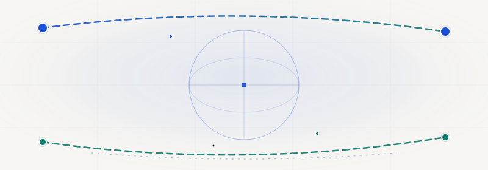

**[中文版 README](README.zh-cn.md) · [中文版封面](assets/hero-zh.svg)**

A continuously updated portfolio of AI multi-model supply-chain research: collecting and comparing independent outputs from different models and agents on the same brief, while tracking global supply-chain shifts in real time.

    

## 📊 About

This repository hosts a portfolio website that places five AI-generated supply-chain research reports side by side — each produced by a different model or agent working independently on the **same research brief**. The goal is to see how different AI minds approach the same question: what they emphasize, what they miss, and where they agree.

Alongside the reports, the site includes a **weekly supply-chain radar** (cross-verified news, research, and trends) and two spin-off applications — [VeloCortex Maritime](#velocortex-maritime) and [TariffLens](#tarifflens), a tariff & trade-compliance reference — that turn the research findings into runnable product prototypes.

## ✨ Features

- 📡 **Live Radar** — Weekly, cross-verified intelligence on shipping rates, tariffs, and supply-chain events — every item links to its original source.
- 🔀 **Multi-Model Comparison** — Same brief, five independent AI tools. A horizontal comparison matrix highlights each model's lens, data sources, and signature trait.
- 🔓 **Fully Open** — All six source repos are on GitHub. Every claim traces to a primary source — no fabrication, no silent data swaps.

## 🔬 The Research Portfolio

Five reports, five AI minds, one brief. Each report is a self-contained, renderable HTML dashboard you can open in a new tab.

| Report | Model · Toolchain | Role | Signature Trait |
| --- | --- | --- | --- |
| **Cursor × Grok** | Grok 4.5 High Fast · Cursor Agent + Canvas | The Archivist-Editor | Journal-style decision support — same 5 questions every edition, directly comparable across issues. |
| **Kimi Agent** | Kimi K3 Deep Research · Kimi Agent | The Feature Writer | Live market quotes + 24 tier-classified citations; explicitly labels fallback snapshots when feeds are down. |
| **WorkBuddy** | Deepseek-V4-Pro · WorkBuddy Agent | The Research Controller | Sticky 3-axis control bar (lens / window / language); every KPI and chart updates instantly. |
| **Gemini** | Gemini 3.6 Flash · Search Grounding | The Strategic Intelligence Officer | Full-stack workbench with AI Q&A that re-grounds to the selected reporting window; keys stay server-side. |
| **Codex** | GPT-6 Astra · OpenAI Codex | The Time-Window Guardian | States its temporal rules up front: flows aggregate but stocks don't, half-year ratios are not quarter averages, missing values are left blank rather than zero. |

## 🚢 Spin-off Apps

### VeloCortex Maritime

Where the research ends, the product begins. **VeloCortex Maritime** is a global container-tracking command center built from the pain points that surfaced across all five reports — visibility gaps, demurrage-risk blind spots, and cold-chain failures.

Features: live AIS vessel tracking, port-congestion heatmaps, demurrage-risk prediction, cold-chain telemetry, and SheetJS export. Built with React 19 + Express, powered by Gemini AI inference on IoT telemetry.

### TariffLens

_Tariff & Trade-Compliance Reference._ A browser-based reference desk for US import tariffs, born from the same findings: how to look up a rate, how to flag ADD/CVD, and why a textual cross-reference never yields a number. It enforces three hard red lines — no automatic classification, never output a number for a textual cross-reference, and a strict three-tier data separation (snapshot rates / live bulletins / offline demo), with every tier boundary labelled.

Features: L1 snapshot (USITC HTS 2026 rev.9 + Chapter 99), L2 live Federal Register pull with local-snapshot fallback, a data-age indicator that flags stale snapshots (14+ days) in vermilion, and a collapsed reference estimate that refuses to convert specific/compound rates. Pure static site — no build, no server.

## 🚀 Quick Start

Clone the portfolio site and serve it locally — no build step required:

```bash
# Clone this repository
git clone https://github.com/SummerPapaya/supply-chain-portfolio.git
cd supply-chain-portfolio

# Serve the static site (the site lives under docs/)
python3 -m http.server 8000 --directory docs

# Open in your browser
# → http://localhost:8000
```

Each report's dashboard lives under `docs/reports/<name>/` and opens in a new tab from the portfolio homepage. The four self-contained single-file reports (cursorgrok / kimiagent / workbuddy / codex) work fully offline; the React-built Gemini report and the VeloCortex spin-off need to be opened from a local server. **TariffLens** is a separate, fully static site (no build step) deployed at `summercommences.com/tarifflens/`.

## 📁 Project Structure

```
docs/                        # GitHub Pages site root
├── index.html               # Portfolio homepage (hero, radar, comparison, cards)
├── radar-data.json          # Weekly radar data (embedded snapshot + override source)
├── reports/
│   ├── cursorgrok/          # Cursor × Grok — static HTML dashboard
│   ├── kimiagent/           # Kimi Agent — single-file HTML + D3.js
│   ├── workbuddy/           # WorkBuddy — single-page HTML + Chart.js
│   ├── codex/               # Codex — offline bilingual HTML + hand-rolled SVG
│   ├── gemini/              # Gemini — React 19 build (static)
│   └── velocortex/          # VeloCortex Maritime — React 19 build (static)
│                             # (TariffLens is a separate repo — SummerPapaya/tarifflens — live at summercommences.com/tarifflens/)
├── learning/                # Embedded CSCP & Six Sigma knowledge graphs
├── assets/                  # Hero SVGs, card curtain previews
└── README-preview.html      # Standalone HTML preview of this README

scripts/                     # Radar data refresh + Feishu auto-AI entry
assets/                      # README hero SVGs (used at repo root)
README.md / README.zh-cn.md  # Bilingual portfolio documentation
```

## 🛠 Tech Stack

- **Portfolio site** — Vanilla HTML/CSS/JS, zero dependencies, zero build step
- **Cursor × Grok / Kimi / WorkBuddy / Codex reports** — Self-contained single-file HTML
- **Gemini / VeloCortex apps** — React 19 + Vite, built to static assets
- **TariffLens app** — Vanilla HTML/CSS/JS, zero dependencies, zero build (separate repo: SummerPapaya/tarifflens)
- **Data sources** — GSCPI, Drewry WCI, SCFI, WTO, NY Fed, UNCTAD, China Customs, IATA, MIIT, NBS, SEMI, ACEA, and more (25+ institutions)

## 📄 License

MIT License — see `LICENSE` for details. Report content is sourced from public reporting; refer to original citations for each data point.

---

<p align="center">
  <em>Built as a living experiment: one brief, five AI minds, one open portfolio.</em><br>
  <a href="https://github.com/SummerPapaya">github.com/SummerPapaya</a>
</p>
