**[English README](README.md) · [English Cover](assets/hero.svg)**

一个持续更新的 AI 多模型供应链研究作品集：在相同的调研命题下，收集并对比不同模型与智能体各自独立产出的结果，同时实时追踪全球供应链的动态变化。

    

## 📊 项目简介

这个仓库托管了一个作品集网站，将四份由 AI 生成的供应链研究报告并排展示——每份报告都由不同的模型或智能体，在**同一个调研命题**下独立产出。我们的目标，是观察不同的 AI "思维"如何回答同一个问题：它们各自强调什么、忽略了什么、又在何处达成共识。

除了报告本身，网站还包含一个**每周供应链雷达**（交叉验证的新闻、研究与趋势），以及一个衍生应用——[VeloCortex Maritime](#velocortex)——将研究发现转化为一个可运行的集装箱追踪指挥中心。

## ✨ 核心特性

- 📡 **实时雷达** — 每周更新、经过交叉验证的情报：覆盖运价、关税与供应链事件——每条信息都链接到原始来源。
- 🔀 **多模型对比** — 同一命题，四款独立 AI 工具。横向对比矩阵清晰呈现每个模型的视角、数据来源与标志性特征。
- 🔓 **完全开放** — 全部五个源仓库均托管于 GitHub。每一个论断都可追溯到一手来源——不虚构、不暗箱替换数据。

## 🔬 研究报告作品集

四份报告，四种 AI 思维，一个命题。每份报告都是一个自包含、可渲染的 HTML 仪表盘，可在新标签页中打开。

| 报告 | 模型 · 工具链 | 角色定位 | 标志性特征 |
| --- | --- | --- | --- |
| **Cursor × Grok** | Grok 4.5 High Fast · Cursor Agent + Canvas | 档案主编 | 杂志式的决策支持——每期固定 5 个问题，各期之间可直接横向比较。 |
| **Kimi Agent** | Kimi K3 Deep Research · Kimi Agent | 深度特稿主笔 | 实时行情报价 + 24 条分级引用；数据源中断时，明确标注兜底快照。 |
| **WorkBuddy** | Deepseek-V4-Pro · WorkBuddy Agent | 研究中控师 | 粘性的三轴控制条（视角 / 窗口 / 语言）；每个 KPI 与图表即时更新。 |
| **Gemini** | Gemini 3.6 Flash · Search Grounding | 战略情报官 | 全栈工作台，内置 AI 问答可重新锚定到所选报告窗口；密钥始终留在服务端。 |

## 🚢 VeloCortex Maritime — 衍生应用

研究结束之处，产品由此而生。**VeloCortex Maritime** 是一个全球集装箱追踪指挥中心，它诞生于四份报告中共同浮现的痛点——可视化盲区、滞期费风险盲区，以及冷链失温。

功能包括：实时 AIS 船舶追踪、港口拥堵热力图、滞期费风险预测、冷链遥测，以及 SheetJS 导出。基于 React 19 + Express 构建，由 Gemini AI 对 IoT 遥测数据进行推理驱动。

## 🚀 快速开始

克隆作品集网站并在本地启动——无需构建步骤：

```bash
# 克隆本仓库
git clone https://github.com/SummerPapaya/supply-chain-portfolio.git
cd supply-chain-portfolio/site

# 启动静态站点
python3 -m http.server 8000

# 在浏览器中打开
# → http://localhost:8000
```

每份报告的仪表盘位于 `reports/` 目录下，可从作品集首页在新标签页中打开。

## 📁 项目结构

```
site/
├── index.html              # 作品集首页（封面、雷达、对比、卡片）
├── radar-data.json         # 每周雷达数据（内嵌快照 + 可覆盖源）
├── reports/
│   ├── cursorgrok/         # Cursor × Grok — 静态 HTML 仪表盘
│   ├── kimiagent/          # Kimi Agent — 单文件 HTML + D3.js
│   ├── workbuddy/          # WorkBuddy — 单页 HTML + Chart.js
│   ├── gemini/             # Gemini — React 19 构建（静态）
│   └── velocortex/         # VeloCortex Maritime — React 19 构建（静态）
├── .gitignore
└── README.md
```

## 🛠 技术栈

- **作品集网站** — 原生 HTML/CSS/JS，零依赖，零构建步骤
- **Cursor × Grok / Kimi / WorkBuddy 报告** — 自包含单文件 HTML
- **Gemini / VeloCortex 应用** — React 19 + Vite，构建为静态资源
- **数据来源** — GSCPI、Drewry WCI、SCFI、WTO、纽约联储、UNCTAD、中国海关等（25+ 机构）

## 📄 许可证

MIT 许可证——详见 `LICENSE`。报告内容源自公开报道；每个数据点的原始引用请参见对应出处。

---

<p align="center">
  <em>作为一个持续演进的实验而构建：一个命题，四种 AI 思维，一个开放的仓库。</em><br>
  <a href="https://github.com/SummerPapaya">github.com/SummerPapaya</a>
</p>
